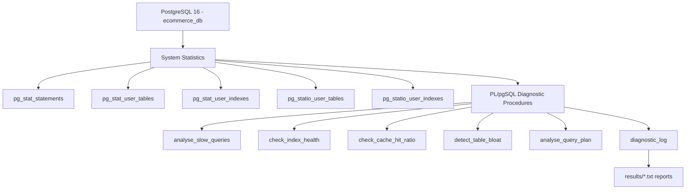

# PostgreSQL Performance Diagnostic Toolkit
PL/pgSQL | EXPLAIN ANALYZE | Index Optimization | Docker

A practical PostgreSQL performance toolkit for diagnosing slow queries, index inefficiency, cache issues, table bloat, and execution-plan problems on a realistic e-commerce workload.

## Project Objective
This project provides a reusable diagnostic workflow that:
- Collects performance signals from PostgreSQL system views.
- Logs findings with severity and actionable recommendations.
- Demonstrates measurable optimization with before/after EXPLAIN ANALYZE.

## What It Diagnoses
- Slow query fingerprints via pg_stat_statements.
- Index usage gaps (unused indexes and high seq-scan patterns).
- Buffer cache hit ratio health.
- Table bloat indicators from dead tuples.
- Query execution-plan behavior (Seq Scan, Index Scan, Bitmap, Join, Sort).

## Dataset Under Diagnosis
Seeded e-commerce schema in ecommerce_db:
- 10,000 customers
- 500 products
- 50,000 orders over the last 180 days

This scale is intentional so the planner shows realistic scan/join behavior.

## Architecture (Mermaid)
Mermaid schematic (render in GitHub or Mermaid Live):
- Mermaid Live: https://mermaid.live/
- Mermaid API docs: https://mermaid.js.org/config/usage.html#using-mermaid-ink



## Optimization Demonstration
Core business query: customer orders in a date range.

Expected behavior:
- Before index: Seq Scan + high rows removed by filter.
- After index: Index Scan + lower execution time.

Latest measured run (example):
- Before: Seq Scan, execution ~16.8 ms
- After: Index Scan, execution ~0.42 ms
- Improvement: ~40x

## Procedure Mapping To Performance Skills
- analyse_slow_queries: query execution profiling and prioritization.
- check_index_health: indexing strategy validation.
- check_cache_hit_ratio: metrics-driven memory/I/O diagnosis.
- detect_table_bloat: storage health and VACUUM planning.
- analyse_query_plan: root-cause analysis of plan choices.

## Setup
1. docker compose up -d
2. Wait ~60 seconds for initialization and seed loading.
3. bash ./scripts/run_full_diagnostic.sh
4. bash ./scripts/run_optimisation_demo.sh
5. Open pgAdmin at http://localhost:8081

## Output Locations
- Full suite reports: results/diagnostic_YYYYMMDD_HHMMSS.txt
- Optimization reports: results/optimisation_YYYYMMDD_HHMMSS.txt
- Structured findings table: diagnostic_log

## Quick SQL Commands
```sql
CALL analyse_slow_queries();
CALL check_index_health();
CALL check_cache_hit_ratio();
CALL detect_table_bloat();
CALL analyse_query_plan('SELECT * FROM orders WHERE customer_id = 100');

SELECT * FROM diagnostic_log ORDER BY checked_at DESC;
SELECT * FROM diagnostic_log WHERE severity = 'CRITICAL';
```

## Security And Repo Hygiene
- No personal credentials are committed.
- Use .env for local secrets.
- results/ and *.log are ignored by git.
